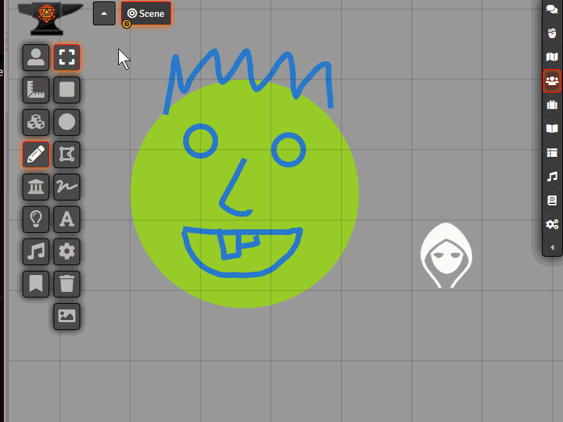

 
 
  
# FoundryVTT - DrawingTokenizer
**[Compatibility]**: *FoundryVTT* 0.6.0+  
**[Systems]**: *any*  
**[Languages]**: *English*  

Ever wanted to use your drawings for your tokens and actors? This module enables you to convert your drawings into images and use those for your tokens, actors etc.

## Installation

1. DrawingTokenizer using manifest URL: https://raw.githubusercontent.com/KayelGee/DrawingTokenizer/master/module.json
2. While loaded in World, enable **_DrawingTokenizer_** module.

## Usage

Select the drawings tool. Select your drawings you wish to convert, then click the convert to image tool. Type in a name and you'll find you image in "yourworld/DrawingTokenizerData/yourimage.png".

## Contact

If you wish to contact me for any reason, reach me out on Discord using my tag: `KayelGee#5241`
